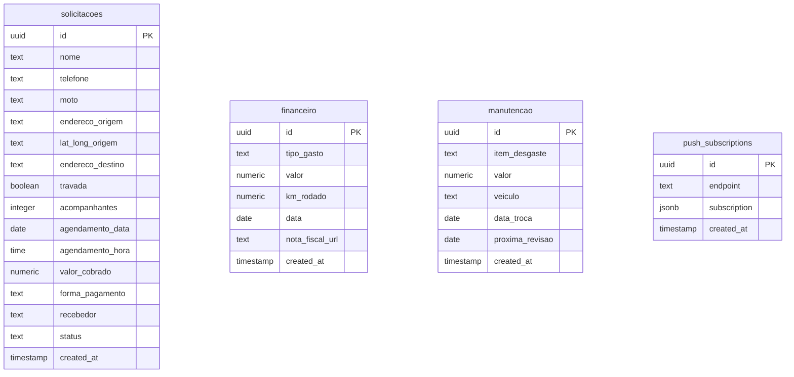

<p align="center">
  
  
  
  
  
  
</p>

<h1 align="center">🏍️ SOS Moto Resgate</h1>

<p align="center">
  <strong>Plataforma web completa para gerenciamento de resgates e guinchos de motocicletas.</strong>
  <br />
  Formulário público para clientes + Painel administrativo para a equipe.
</p>

<p align="center">
  <a href="#-funcionalidades">Funcionalidades</a> •
  <a href="#%EF%B8%8F-tecnologias">Tecnologias</a> •
  <a href="#-estrutura-do-projeto">Estrutura</a> •
  <a href="#-como-rodar">Como Rodar</a> •
  <a href="#-banco-de-dados">Banco de Dados</a> •
  <a href="#-deploy">Deploy</a>
</p>

---

## 📋 Sobre o Projeto

O **SOS Moto Resgate** é um sistema web desenvolvido para uma empresa de guincho de motocicletas. Ele resolve o problema de receber solicitações de resgate de forma organizada e em tempo real, substituindo o processo manual via ligação/WhatsApp.

O sistema é dividido em duas partes:

| Área | Descrição | Acesso |
|------|-----------|--------|
| **Página Pública** | Formulário para o cliente solicitar o resgate da moto | Qualquer pessoa |
| **Painel Admin** | Dashboard completo com gestão de resgates, finanças e manutenção | Login protegido |

---

## ✨ Funcionalidades

### 📱 Página de Solicitação (Cliente)
- Formulário completo com validação em tempo real
- **Geolocalização GPS** — captura automática do endereço via API do navegador
- Geocodificação reversa com **OpenStreetMap/Nominatim**
- Escolha entre resgate **urgente** ou **agendado** (com data e hora)
- Informação de moto travada, acompanhantes e cidades
- Validação inteligente: impede origem e destino na mesma rua
- Tela de sucesso com redirecionamento para **confirmação via WhatsApp**
- Interface 100% responsiva (mobile-first)

### 🖥️ Painel Administrativo (Dashboard)

#### 📊 Inteligência Financeira
- KPIs em tempo real: **Receita**, **Gastos** e **Lucro Líquido**
- Gráfico de barras comparativo mensal (Lucro vs Despesas)
- **Métrica de Ouro**: Lucro por KM rodado com alerta de eficiência
- Filtros por período: Hoje, 7 Dias, Mês ou Personalizado

#### 🚨 Resgates em Tempo Real
- Lista completa de todas as solicitações com status visual
- **Notificações em tempo real** via Supabase Realtime (com alarme sonoro)
- Fluxo de status: `Pendente → Em Andamento → Concluído`
- Edição inline de valor cobrado, forma de pagamento e recebedor
- Lançamento de resgate manual (para chamadas feitas por telefone)
- Link direto para **rota no Google Maps** (Base → Busca → Entrega)

#### 💰 Controle Financeiro
- Registro de gastos operacionais (combustível, pedágio, etc.)
- Controle de KM rodado por lançamento
- Campo para URL de nota fiscal

#### 🔧 Checklist de Manutenção
- Registro de itens de desgaste por veículo
- Controle de data da troca e próxima revisão
- Exclusão com confirmação

### 🔐 Autenticação
- Login seguro via **Supabase Auth** (email/senha)
- Proteção de rotas: dashboard redireciona para login se não autenticado
- Sessão persistente

### 📲 PWA (Progressive Web App)
- Instalável no celular como um app nativo
- Service Worker para cache e funcionamento offline básico
- Ícones e splash screen configurados
- Suporte a **Push Notifications** via Web Push API

### 🌙 Tema Escuro
- Toggle de tema claro/escuro
- Persistência da preferência do usuário
- Transição suave entre temas

---

## 🛠️ Tecnologias

| Categoria | Tecnologia |
|-----------|------------|
| **Framework** | [Next.js 16](https://nextjs.org/) (App Router) |
| **Linguagem** | [TypeScript 5](https://www.typescriptlang.org/) |
| **UI** | [React 19](https://react.dev/) |
| **Estilização** | [Tailwind CSS 4](https://tailwindcss.com/) |
| **Ícones** | [Lucide React](https://lucide.dev/) |
| **Formulários** | [React Hook Form](https://react-hook-form.com/) |
| **Backend/DB** | [Supabase](https://supabase.com/) (PostgreSQL + Realtime + Auth) |
| **Deploy** | [Vercel](https://vercel.com/) |
| **PWA** | Service Worker + Web Push API |

---

## 📁 Estrutura do Projeto

```
src/
├── app/
│   ├── page.tsx              # Página pública (formulário de resgate)
│   ├── layout.tsx            # Layout global (header, tema, PWA)
│   ├── globals.css           # Estilos globais e variáveis CSS
│   ├── manifest.ts           # Configuração do PWA
│   ├── login/
│   │   └── page.tsx          # Tela de login do admin
│   ├── dashboard/
│   │   └── page.tsx          # Painel administrativo completo
│   ├── instalar/
│   │   └── page.tsx          # Página de instalação do app (PWA)
│   └── api/
│       └── push/
│           ├── subscribe/    # API para registrar dispositivos (push)
│           └── send/         # API para disparar notificações push
├── components/
│   ├── PWARegister.tsx       # Registro automático do Service Worker
│   └── ThemeToggle.tsx       # Botão de alternar tema claro/escuro
└── lib/
    ├── supabase.ts           # Cliente Supabase configurado
    └── theme-context.tsx     # Context API para gerenciar o tema
```

---

## 🚀 Como Rodar

### Pré-requisitos
- [Node.js](https://nodejs.org/) 18+
- Conta no [Supabase](https://supabase.com/) (plano gratuito funciona)

### 1. Clone o repositório

```bash
git clone https://github.com/AbnerMatheusz/SoS-Moto-Resgate.git
cd SoS-Moto-Resgate
```

### 2. Instale as dependências

```bash
npm install
```

### 3. Configure as variáveis de ambiente

Crie um arquivo `.env.local` na raiz do projeto:

```env
NEXT_PUBLIC_SUPABASE_URL=https://seu-projeto.supabase.co
NEXT_PUBLIC_SUPABASE_ANON_KEY=sua_chave_anon_aqui

# Opcional: para Push Notifications
NEXT_PUBLIC_VAPID_PUBLIC_KEY=sua_vapid_public_key
VAPID_PRIVATE_KEY=sua_vapid_private_key
```

> 💡 Você encontra as chaves em: **Supabase Dashboard → Settings → API**

### 4. Configure o banco de dados

Execute o conteúdo do arquivo [`schema.sql`](schema.sql) no **SQL Editor** do Supabase para criar as tabelas necessárias.

### 5. Rode o servidor de desenvolvimento

```bash
npm run dev
```

Acesse [http://localhost:3000](http://localhost:3000) no navegador.

---

## 🗄️ Banco de Dados

O projeto utiliza **3 tabelas principais** + 1 auxiliar no Supabase (PostgreSQL):



> **Realtime** está habilitado na tabela `solicitacoes` para notificações instantâneas no dashboard.

---

## 🌐 Deploy

O projeto está configurado para deploy automático na **Vercel**:

1. Importe o repositório no [Vercel](https://vercel.com/new)
2. Adicione as variáveis de ambiente (`.env.local`) nas configurações do projeto
3. O deploy acontece automaticamente a cada `push` na branch `main`

---

## 🤖 Uso de Inteligência Artificial

Este projeto foi desenvolvido por mim durante o **3º semestre** da faculdade como uma solução real para uma empresa de guincho de motocicletas.

A maior parte do sistema (formulário, dashboard, integração com Supabase, lógica de negócio, design) foi desenvolvida por mim com base nos meus conhecimentos. Porém, em alguns pontos mais avançados, utilizei **ferramentas de IA como auxílio** para entender e implementar funcionalidades que iam além do conteúdo visto em sala de aula:

| Funcionalidade | Por que precisei de ajuda |
|---|---|
| **PWA (Progressive Web App)** | Configuração do Service Worker e registro para instalação no celular — conceito que não é abordado no curso |
| **Web Push Notifications** | Configuração de VAPID keys, subscription no navegador e disparo de notificações server-side — API de baixo nível com pouca documentação em PT-BR |
| **Web Audio API** | Gerar sons de alerta programaticamente sem arquivos de áudio — API pouco conhecida e com sintaxe complexa |
| **Geocodificação Reversa** | Converter coordenadas GPS (latitude/longitude) em endereço legível usando a API do OpenStreetMap (Nominatim) — integração com API externa |

> **Nota:** A IA foi usada como ferramenta de aprendizado e apoio técnico, assim como se usa documentação, Stack Overflow ou tutoriais. Todo o código foi revisado, compreendido e adaptado por mim para atender às necessidades reais do projeto.

---

## 📄 Licença

Este projeto foi desenvolvido como solução real para uma empresa de guincho de motocicletas.

---

<p align="center">
  Feito com 💙 por <a href="https://github.com/AbnerMatheusz">Abner Matheus</a>
</p>
